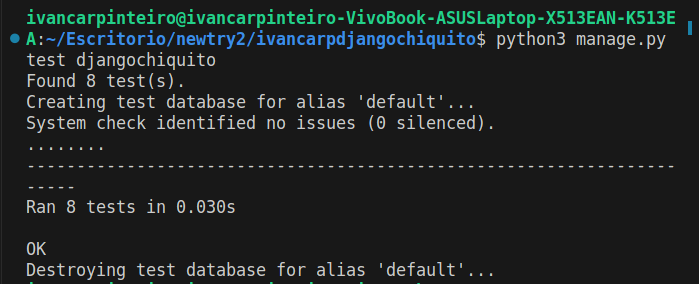

*Kubernetes Reporte Ivan Carpinteiro Salazar*
-- 
# ¿Cuál es la versión LTS de Django?


Basicamente, LTS hace referencia a Long-Term Support, lo cual significa que es una versión que recibirá un soporte prolongado y actualizaciones de seguridad por un largo período de tiempo. Por lo general, una versión LTS se considera estable y confiable, siendo recomendada para su implementación en entornos de producción a largo plazo.

Las versiones LTS resultan especialmente relevantes para proyectos y organizaciones que buscan mantener estabilidad y continuidad a largo plazo, ya que garantizan la entrega de correcciones de errores, actualizaciones de seguridad y, en algunos casos, incluso nuevas funcionalidades durante un período extenso. Esto permite a los usuarios y desarrolladores confiar en la versión LTS, asegurando el funcionamiento de sus aplicaciones o sistemas sin necesidad de actualizar.

**Versión usada: _4.2.1_**

---

## Configuración del proyecto

Primero, para crear el proyecto, se usa el siguiente comando:

```bash
django-admin startproject <Nombre del proyecto>
```


Al ejecutar este comando, se creó una carpeta con el nombre del proyecto y dentro de ella encontré una serie de archivos .py, que eran los siguientes:

- El archivo `manage.py` es una utilidad de línea de comandos que me permitió interactuar con mi proyecto Django.
- El directorio interno `<Nombre del proyecto>` es el paquete de Python real para mi proyecto y su nombre se utilizó para importar sus componentes.
- El archivo `__init__.py` era un archivo vacío que indicaba que el directorio era un paquete de Python.
- El archivo `settings.py` contenía la configuración de mi proyecto Django.
- El archivo `urls.py` definía las URL de mi proyecto Django.
- Los archivos `asgi.py` y `wsgi.py` eran puntos de entrada para servidores web compatibles con ASGI y WSGI, respectivamente.

Ahora ejecutamos el servidor con
```bash
python3 manage.py runserver
```
Al ejecutar este comando en la línea de comandos, Django comenzó a escuchar en el puerto predeterminado (generalmente el puerto 8000). Podemos saber que está funcionando correctamente y que todo salió bien cuando logramos ver una pantalla que muestra el texto "The install worked successfully congratulations" junto con la imagen de un cohete.

Hay más formas de levantar el servidor, como el comando "python manage.py runserver 8080", que cambia el puerto en el que se ejecuta el servidor de desarrollo de Django. En lugar de utilizar el puerto predeterminado (8000), el servidor ahora escuchará en el puerto 8080. Esto es útil si el puerto 8000 ya está en uso o si deseas utilizar un puerto específico para tu aplicación Django.

Por otro lado, el comando "python manage.py runserver 0.0.0.0:8000" cambia tanto la dirección IP como el puerto en los que se escucha el servidor de desarrollo. Al especificar "0.0.0.0" como dirección IP, el servidor estará disponible para conexiones desde cualquier dirección IP, lo que puede ser útil si deseas acceder al servidor desde diferentes dispositivos en tu red local.

---
# Creación de la app

Todo lo que realizo fue completamente para la configuración inicial del proyecto. Ahora debemos proceder a crear la base de nuestra aplicación utilizando el siguiente comando:
```bash
python manage.py startapp "Nombre_app"
```

Al ejecutar este comando, Django generará una estructura básica de directorios y archivos para la nueva aplicación dentro del proyecto, los cuales son los siguientes:

- `__init__.py`: Es un archivo vacío que indica que el directorio "Nombre_de_la_app" es un paquete de Python.
- `admin.py`: Es un archivo donde puedes registrar los modelos de la aplicación para administrarlos en el panel de administración de Django.
- `apps.py`: Es un archivo de configuración de la aplicación donde puedes realizar ajustes específicos si es necesario.
- `migrations/`: Es un directorio donde se almacenarán las migraciones de la base de datos para esta aplicación. Además, contiene un archivo `__init__.py` que indica que el directorio "migrations" es un paquete de Python.
- `models.py`: Es un archivo donde puedes definir los modelos de datos de la aplicación.
- `tests.py`: Es un archivo donde puedes escribir pruebas automatizadas para tu aplicación.
- `views.py`: Es un archivo donde puedes definir las vistas que manejan las solicitudes HTTP y generan las respuestas correspondientes.

Procederemos a crear nuestra primera vista. En este caso, se trata de un simple mensaje de saludo. Dentro del archivo `views.py` de nuestra carpeta de la aplicación, agregaremos el siguiente código:

```python
from django.http import HttpResponse

def index(request):
    return HttpResponse("Hello, world. You're at the polls index.")
```
Básicamente, este código muestra el mensaje "Hello, world. You're at the polls index." como respuesta en el navegador web cuando se accede a la URL asociada a esta vista.

Ahora debemos de hacer que la página donde apuntar, por ello crearemos un archivo llamado urls.py en la carpeta de la aplicación y lo modificaremos de la siguiente manera:


```python
from django.urls import path
from . import views

urlpatterns = [
    path("", views.index, name="index"),
]

```
Este código define una única ruta que coincide con la URL base de la aplicación y llama a la función de vista index cuando se accede a esa URL.

Ahora, desde la carpeta del proyecto, agregaremos lo siguiente al archivo urls.py:


```python
from django.contrib import admin
from django.urls import include, path

urlpatterns = [
    path("Nombreapp/", include("nombreapp.urls")),
    path("admin/", admin.site.urls),
]
```
Este código configura las rutas del proyecto Django para redirigir las solicitudes a diferentes partes del proyecto. Las URL que comiencen con "Nombreapp/" serán manejadas por las rutas definidas en la aplicación "nombreapp", y las URL que comiencen con "admin/" serán manejadas por el panel de administración de Django.
***

# Creación de modelos

El comando `python manage.py migrate` en Django se utiliza para aplicar las migraciones pendientes en la base de datos. Las migraciones son cambios en la estructura de la base de datos, como la creación o modificación de tablas y campos. Al ejecutar este comando, Django sincroniza la base de datos con la definición de los modelos en el proyecto, creando tablas, realizando modificaciones y aplicando índices y restricciones. Es importante ejecutar `migrate` cada vez que se realicen cambios en los modelos para mantener la base de datos actualizada.

Ahora lo que vamos a hacer es crear un modelo. Un modelo en Django es una representación de la estructura y comportamiento de una tabla en la base de datos, permitiendo interactuar con los datos de forma sencilla a través de la interfaz de Django ORM (Object-Relational Mapping).

La forma en la que lo vamos a hacer es dentro de la carpeta de la app y en el archivo `models.py` con los siguientes códigos:

```python
from django.db import models

class Question(models.Model):
    question_text = models.CharField(max_length=200)
    pub_date = models.DateTimeField("date published")

class Choice(models.Model):
    question = models.ForeignKey(Question, on_delete=models.CASCADE)
    choice_text = models.CharField(max_length=200)
    votes = models.IntegerField(default=0)

```
Estos modelos representan una estructura de base de datos para una encuesta, donde una pregunta puede tener varias opciones de respuesta. La relación entre Question y Choice se establece mediante una clave externa (ForeignKey) en el modelo Choice, que referencia al modelo Question. Esto permite acceder y manipular los datos de las preguntas y opciones de respuesta en la base de datos utilizando el ORM de Django.

para aplicar los cambios debemos de entrar a settings de el proyecto y agregar en la parte de apps instaladas agregar ""Nombreapp".apps."Nombreapp"Config" ahora aplicamos los cambios:


```bash
python manage.py makemigrations "Nombreapp"
```
y veremos que en la app en la carpeta de migrations podemos observar que se agrego un archivo llamado 0001_initial.py el cual podemos interpretar mejor usado el comando:

```bash
python3 manage.py sqlmigrate djangochiquito 0001
```
Finalmente, utilizamos el comando "migrate" para aplicar las migraciones y crear las tablas y modelos en la base de datos:

```bash
python manage.py migrate
```
Con esto, los modelos se crearán en la base de datos y estarán listos para interactuar con los datos a través de Django.

---
# Api Django
Para interactuar con la terminal de Django, ejecutamos el siguiente código:
```bash
python manage.py shell
```
Esto nos brinda un entorno interactivo donde podemos experimentar con nuestra aplicación Django y realizar tareas de desarrollo en tiempo real sin necesidad de ejecutar un servidor web.En este entorno, podemos realizar entradas de información a los modelos y consultar los elementos que contienen.
Ahora, necesitamos crear un usuario para acceder al panel de administración. Podemos hacerlo con el siguiente comando:
```bash
python manage.py runserver
```
Ahora, podemos verificar el acceso al panel de administración abriendo el navegador y dirigiéndonos a localhost/admin. Ingresamos las credenciales del usuario que creamos anteriormente. En el panel de administración, podremos ver los modelos básicos que Django proporciona, como los usuarios. Sin embargo, también podemos dar acceso a nuestros propios modelos desde el archivo admin.py que se encuentra en la carpeta de la aplicación.

Para agregar nuestros modelos al panel de administración, agregamos el siguiente código al archivo admin.py:
```python
from django.contrib import admin
from .models import Question
from .models import Choice
from .models import BuenasPracticas
from .models import Categoria

admin.site.register(Question)
admin.site.register(Choice)
admin.site.register(BuenasPracticas)
admin.site.register(Categoria)

```
En este ejemplo, hemos importado nuestros modelos (Question, Choice, BuenasPracticas y Categoria) y los hemos registrado en el panel de administración utilizando el método admin.site.register(). Esto nos permitirá gestionar y visualizar los registros de estos modelos desde el panel de administración de Django.
Con esta configuración, podemos aprovechar al máximo el panel de administración de Django y tener un control completo sobre nuestros modelos y datos desde una interfaz fácil de usar.

---
# Forma correcta de usar las views y url

Para crear las páginas que veremos en nuestra página web, utilizamos vistas en Django. Una vista es una función que recibe una solicitud HTTP y devuelve una respuesta HTTP. Por ejemplo, podemos tener una vista simple que muestra un texto:

```python
from django.http import HttpResponse

def buenas_practicas(request):
    return HttpResponse("Estás viendo las buenas prácticas.")
```
En este caso, la vista "buenas_practicas" devuelve una respuesta HTTP con el texto "Estás viendo las buenas prácticas". Sin embargo, para que podamos acceder a esta vista en nuestra página web, necesitamos configurar los enlaces utilizando el archivo urls.py.En Django, los enlaces se configuran mediante el uso de rutas (path) en el archivo urls.py. La estructura general de una ruta es la siguiente:

```python
path("ruta/", views.vista, name="nombre_de_ruta"),
```

la primera parte entre comillas es el vinculo con el que entraremos siguiendo la siguiente estructura localhost/"Nombreapp"/"lo que pusimos en las comillas del path" hay muchas formas en las que podemos vincular nuestras vistas ala app pero esa es la mas comun.
hasta este momento solo hemos estado mostrando texto en pantalla pero claramente esto no es suficiente para la creacion de una pagina web por ello tambien podemos ya realizar cosas mas avanzadas como usar propio codigo html o mostrar informacion segun “x” o “y” condiciones.

---
#Pruebas automatizadas
Django incluye un framework de pruebas integrado que facilita la creación y ejecución de pruebas automatizadas. Este framework se basa en el módulo de pruebas unitarias de Python, llamado unittest, y se extiende con funcionalidades específicas de Django para realizar pruebas de aplicaciones web.

Las pruebas automatizadas en Django se definen en archivos de pruebas Python que se crean dentro de la estructura de la aplicación. Estos archivos de pruebas contienen clases de prueba que heredan de las clases proporcionadas por Django, como django.test.TestCase o django.test.SimpleTestCase. Dentro de estas clases de prueba, se definen métodos de prueba que verifican el estado. 
 


---
# Dándole estilo a los elementos de la pagina

lo primero que hacemos es crear una carpeta llamada static dentro del directorio de nuestra app y dentro del mismo nombramos una carpeta con el mismo nombre de la app dentro de ella crearemos un archivo style.css con el que podamos modificar los estilos de la pagina web de modo que quede de la siguiente forma: ("DirectorioDeLaApp"/static/"NombreDeLaApp"/style.css)
Dentro del mismo ponemos lo siguiente:
```css
li a {
    color: green;
}
body {
    background: white url("images/background.png") no-repeat;
}
```

podemos ver que es exactamente igual que cuando se aplican estilos en un proyecto html normal. una vez puesto eso debemos de referenciar nuestro css a la pagina con el siguiente código en el index o cualquier otro template:
```HTML

<link rel="stylesheet" href="">
```
---
# Mejorando la parte de administración


Al igual que en el lado de la página web normal, también es importante facilitar las tareas de administración en el panel de administración de Django. Podemos personalizar la forma en que se crean nuevas selecciones o cómo se presenta la información en el panel de administración mediante el archivo admin.py, que se encuentra dentro de la carpeta de la aplicación.

Una de las opciones que nos proporciona Django es la capacidad de mostrar la información en forma de lista o tabla, donde todo está mejor organizado y fácilmente accesible.
La estructura que utilizamos en admin.py es similar a la siguiente:

```python
from django.contrib import admin
from .models import Choice
class ChoiceInline(admin.TabularInline):#Creamos una clase para el modelo choice y metemos el metodo
    model = Choice #seleccion del modelo
    extra = 3 #Poner cuantas opciones extra podemos agregar
```
Además de `admin.TabularInline`, existen otros métodos y clases que se pueden utilizar para personalizar aún más el panel de administración en Django:

1. `GenericStackedInline` y `GenericTabularInline` permiten gestionar relaciones genéricas en el panel de administración.
2. `NestedTabularInline` y `NestedStackedInline` permiten anidar líneas en línea dentro de otras líneas, útil para modelos relacionados en varios niveles de profundidad.
3. `ModelAdmin.get_inline_instances()` personaliza las instancias de las clases en línea de forma dinámica, permitiendo incluir o excluir líneas en línea según condiciones específicas.
4. `ModelAdmin.inlines` es una propiedad para especificar listas de clases en línea, lo que permite configuraciones diferentes para la administración de modelos relacionados en el panel de administración.

Además de eso, lo que se hizo fue crear una plantilla personalizada para la página de índice del sitio administrativo, lo cual es bastante sencillo. Primero, crea un archivo llamado "index.html" dentro del directorio "templates/admin" en el directorio raíz de tu proyecto.

En el archivo "index.html", puedes escribir tu propio código HTML para personalizar la apariencia de la página de índice. Por ejemplo, puedes agregar un encabezado, cambiar el diseño de las aplicaciones listadas o agregar enlaces adicionales.

--- 
# Agregar la barra de depuracion django

Primero debemos de instalar la dependencia necesaria usando el siguiente codigo:
```bash
python -m pip install django-debug-toolbar
```
La barra de herramientas de depuración de Django Debug Toolbar se integra en la interfaz de usuario de tu aplicación web y ofrece información detallada y útil sobre el rendimiento, la ejecución de consultas de base de datos, los registros de errores y más. Te ayuda a comprender cómo funciona tu aplicación y a identificar posibles problemas y cuellos de botella.
Te permite tener una visión detallada del rendimiento y el comportamiento de tu aplicación, lo que facilita la identificación y solución de problemas.

---
## Imagenes de todo el proceso: 


